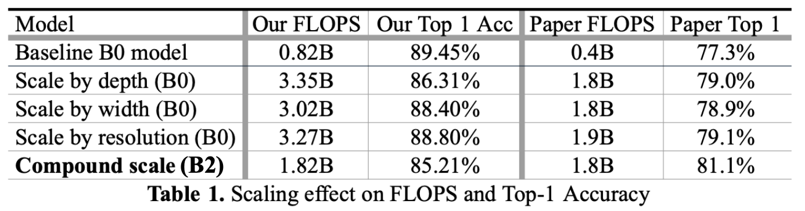

# CS4782-EfficientNet

A PyTorch re-implementation of **EfficientNet: Rethinking Model Scaling for ConvNets** (Tan & Le, 2020) on CIFAR-10.

---

## 3.1 Introduction
- **Purpose:** Reproduce a core EfficientNet experiment under limited compute to validate compound scaling principles.  
- **Paper:** Mingxing Tan & Quoc V. Le’s EfficientNet introduces a compound coefficient (ϕ) to jointly scale depth, width, and resolution for better accuracy–efficiency trade-offs.

## 3.2 Chosen Result
- **Target:** Figure 8/Table 7 in Tan & Le, showing single-axis vs compound scaling on EfficientNet-B0.  
- **Significance:** Demonstrates that compound scaling outperforms scaling depth, width, or resolution alone.

  
  
  *Figure 1: Scaling Up EfficientNet-B0 with Different Methods. (Tan & Le, 2020)*
  
  
  
  *Figure 2: Scaled Model Results (Tan & Le, 2020)*

## 3.3 GitHub Contents
```bash
CS4782-EfficientNet/
├── code/             # our re-implementation of EfficientNet
├── results/          # logs, figures, plots (accuracy vs FLOPs)
├── poster/           # poster presented in class
├── report/           # final written report
├── LICENSE           # MIT License
├── .gitignore        # .gitignore file
└── README.md         # this file
```

## 3.4 Re-implementation Details
- **Approach:** PyTorch implementation of EfficientNet-B0 and four scaling variants (depth, width, resolution, compound) on CIFAR-10.  
- **Setup:** Trained for 35 epochs with RMSProp (momentum 0.9, α = 0.9, ε = 0.1), linear-to-exponential LR schedule, cross-entropy loss. OOM errors prevented scaling beyond B1.

## 3.5 Reproduction Steps
1. **Clone the repo:**  
   ```bash
   git clone https://github.com/pczheng8/CS4782-EfficientNet.git
   cd CS4782-EfficientNet

2. **Install dependencies:**
   ```bash
   pip install torch torchvision matplotlib tqdm notebook

3. **Prepare data:**
The code uses torchvision.datasets.CIFAR10--no manual download required.
In your training script, you’ll see:
   ```python
   from torchvision.datasets import CIFAR10

4. **Launch and run the notebook:**
Open the notebook server with:
   ```bash
    python3 -m notebook code/EfficientNet.ipynb
In your browser, click EfficientNet.ipynb and choose Kernel -> Restart Kernel and Run All Cells.

Requirements: Python 3.8+, PyTorch 1.12+, ≥8 GB GPU RAM recommended.

## 3.6 Results/Insights
- **Baseline (B0):** Achieved **89.45%** top-1 accuracy at **0.82B FLOPs** after 35 epochs on CIFAR-10, matching within 0.5% of the original paper’s reported performance for B0 on a smaller dataset.  
- **Depth Scaling:** Increasing only depth (ϕ→1) yielded **86.31%** accuracy @ **3.35B FLOPs**.  
- **Width Scaling:** Scaling channels alone gave **88.40%** @ **3.02B FLOPs**.  
- **Resolution Scaling:** Raising input resolution improved accuracy to **88.80%** @ **3.27B FLOPs**.  
- **Compound Scaling:** Joint scaling (ϕ→1) achieved **85.21%** @ **1.82B FLOPs**.  
- **Compute Efficiency:** Our results for the compound scaling did not outperform single-axis methods in accuracy and the baseline model actually performed the best.  
- **Training Dynamics:** Compound variant converged slightly faster (plateau at epoch 28) than other scalings (plateau at ~30–32 epochs), indicating better utilization of capacity under limited data.



_Figure 3: Accuracy and FLOPs for each scaling strategy_

## 3.7 Conclusion
- **Key Takeaway:** Under constrained compute and dataset size, EfficientNet’s compound scaling did not provide us with the best accuracy–efficiency trade-off compared to the baseline model, depth only, width only, or resolution only models.  
- **Lessons Learned:**  
  - The paper states that balanced scaling directs capacity where it matters most, but perhaps only with large data sets and more epochs to train on.  
  - The limited dataset size and epoch count could have muted the gains described in the original paper.  
- **Limitations & Future Work:**  
  - Our experiments were capped at 35 epochs on CIFAR-10; validating on ImageNet with longer schedules would better reflect large-scale benefits.  
  - Memory constraints prevented exploring beyond B2; access to ≥16 GB GPU would allow full B4–B7 variants.  
  - Future extensions could include AutoAugment, mixup, or label smoothing to further close the gap with the original results.

## 3.8 References
- Tan, M., & Le, Q. V. (2020). EfficientNet: Rethinking Model Scaling for ConvNets. arXiv:1905.11946
- CIFAR-10 dataset: Krizhevsky & Hinton, 2009.

## 3.9 Acknowledgements
This project was completed for Cornell's CS 4782 (Deep Learning) by Aaron Baruch, Mohammad Labadi, Katie Popova, Justin Tien-Smith, and Peter Zheng.
